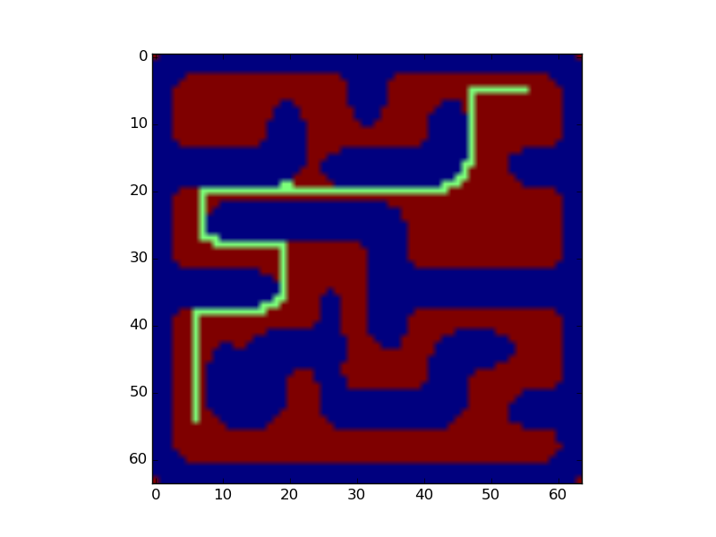
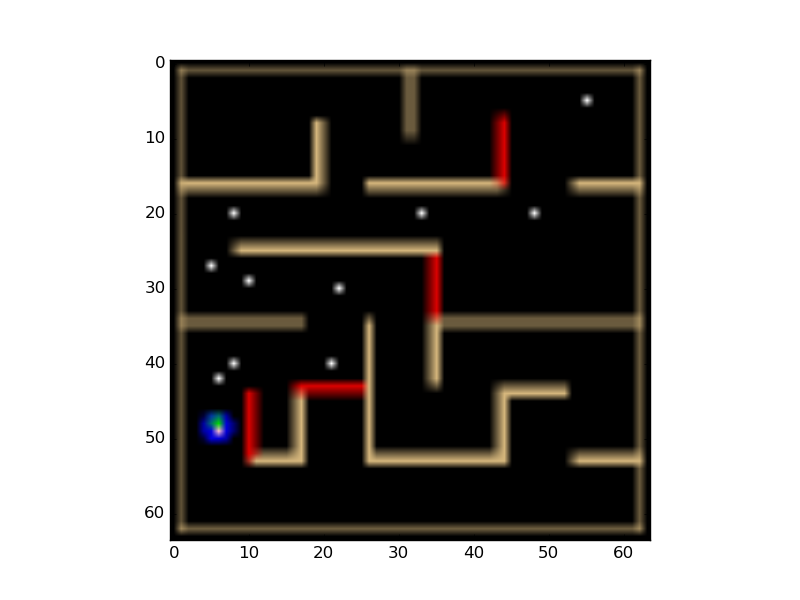
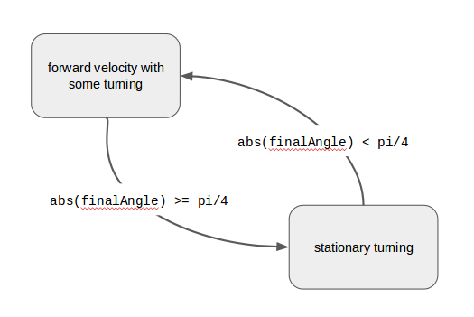
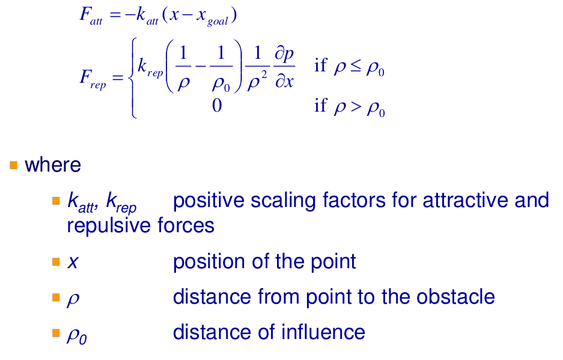

# Distributed Autonomous Robotic Systems Lab 2
by Ryan Louie, A0149643X

# Introduction
An overview of the main ideas used in your approach.

## Path Planning
* Image processing to find pixels in the map that are valid goal destinations in the map.  A successful valid path image processor would not include walls, or locations near the walls.
* Of these candidate path pixels, we perform a graph based search like A* search, finding a contiguous path of pixels connecting start and final goal
* An important part of the A* search that took me a lot of effort to realize was how to save the parent nodes in the graph based search.  This was crucial for back tracing the optimal path once you have found the goal.
* The resolution of the goals is important for the path execution algorithm. From the path chain, we can select intermediate goal elements `n` pixels away from one another

## Path Execution and Obstacle Avoidance

# Algorithm and Strategy

## Path Planning

### What didn't work
The simplest idea was to have the final goal as the only goal; then, in theory, the robot would only use obstacle avoidance, while keeping the goal in mind.  This approach failed badly, because a path planning algorithm like this one (or lack thereof) caused the robot to fall into local minima, especially when it was stuck in a corner of the wall, but the goal was on the opposite side.

### Current Solution
Thus, the idea of representing the objective as a series of intermediate goals was used.  Since I represented the map as a grid of 64 x 64 pixel locations, each pixel location was a possible waypoint destination for the robot.  Of the total map space, there were pixels that were occupied by walls. These pixels were subtracted out.  In addition, there were some locations which, for practical reasons such as the robots size, the robot cannot occupy. I used a Gaussian blur filter on the image, so that pixels near the walls would be colored a similar color as the walls after the blur operation. I then used a certain threshold value on the RGB color intensities to produce a binary grid map which had the pixel locations with True and False values representing the locations for which the robot was and was not allowed to move, respectively.

Accounting for the start and final goal pixels, the possible ways a robot can move between the pixels is represented as a tree like structure, where neighboring pixels one has not visited become children of the current move.  I implemented an A* algorithm by scratch, using city block distance from the final goal as the heuristic. An important part of the A* search that took me a lot of effort to realize was how to save the parent nodes in the graph based search.  This was crucial for back tracing the optimal path once you have found the goal.

The resolution of the goals, or how far each intermediate goal is spaced, is important for the path execution algorithm. From the optimal path chain discovered by the A* algorithm, I selected intermediate goal elements `n = 8` pixels away from one another.



## Path Execution and Obstacle Avoidance
The path execution was developed concurrently with path planning. I hard coded values of map locations specified as pixel coordinates as intermediate goals of the path, and then tried to write a controller that would follow those coordinates to the goal.

The advantage of this was to develop the control of the robot without depending on the path planner to be implemented.  The disadvantage is that the intermediate goals are artificial - and might not be representative of the distribution of goals that the path planning algorithm would generate.  If the path planning algorithm does not generate intermediate goals of the same locations as I have done, this situation largely remained untested and parameters might have to be tuned once again.



### What didn't work
* A method of turning faster when closer to the object.

    `k_angular = 20.0 * (1.0 / (goal_distance + 1.0))`

* A three point turn method, if the desired heading was behind the robot

    ```
    #if goal is behind you
    if np.abs(delta_theta) > 3 * np.pi / 4:
      # three point turnish!
      forward_vel *= -1
      omega *= 1.5
    ```

* Discontinuous functions for my angular and translational velocity controllers. I originally used a finite-state controller for controlling the robot towards a desired heading, given by the potential field.  While this idea, simple enough with incorporating moments where the robot should turn stationary and then move forward, became hard to tune because the conditionals "if in a certain distance", made the robot jerky and actually uncontrollable. Below is an example of the controller which was proposed, but did not end up working.



* For the longest time, my transformations of heading vectors from map frame to robot frame. What I get for not testing my functions

### Current Solution

#### Obstacle Sensing and Artificial Potential Fields
Artificial Potential Fields were used to determine the vector of motion, in order to follow intermediate goals while avoiding walls. The sensing mechanisms for walls was inspired by LIDAR sensors. All sensing is based on the processed overhead view of the maze. I use sensing from 8 equal angles around the entire circumference of the robot. The LIDAR range values at each angle is computed as the distance between the robot and the wall in pixel space. For LIDAR ranges at the diagonals, I multiply the result by `sqrt(2)` to account for the additional length of the hypotenuse at `k*(pi/4)`. Since I also know the pixel location of the next goal, a vector difference is computed between the robot location and the goal location.

The LIDAR measurements are transformed into repulsive force vectors and the difference vector between robot location and goal becomes an attractive force vector. The magnitude of the attractive force and repulsive forces were taken from the equations given in lecture. The distance of influence was chosen to be 2 pixels, as this distance seemed to match the range of the robots low-range proximity sensors.



#### Controlling the robot towards intermediate goals

In the stationary turning state

* P / PD / PID control?
* Setting the angular velocity to be less (half?)


#### Accounting for the moving doors
TODO FUCK

# Results and Discussion
How well your algorithm performs, document the success and failure. Assess the success of your program with regard to the reported results, and explain any limitations, problems or improvements you would make.
